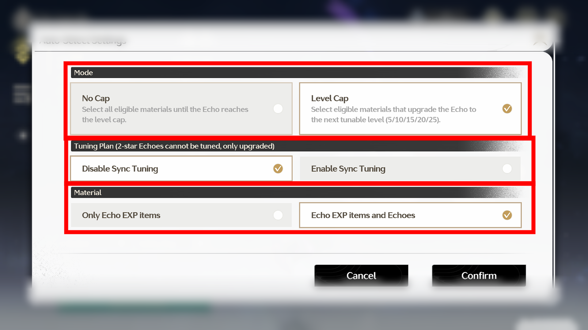

# 🌊 WuWa Echo Fodder Maker (EchoFlux)

**Automated tool to level up Echoes to Level 5 in Wuthering Waves for easy fodder usage.**


## 🛡️ IMPORTANT: Run as Administrator
**You MUST run this program as Administrator.**
Wuthering Waves blocks simulated mouse clicks from non-privileged applications.

- **exe:** Right-click `EchoFlux.exe` -> **Run as Administrator**.
- **Python:** Open CMD/PowerShell as Administrator before running the script.
> *If you don't do this, the program will click on your desktop/wallpaper but do nothing inside the game.*

---

## 🧐 Why create this?
In **Wuthering Waves**, you cannot use Level 0 Echoes directly as XP material (fodder) for other Echoes. You have to manually delete them or level them up slightly.
This tool automates the process of upgrading trash Echoes to **Level 5**. Once they are Level 5, they become visible as upgrade materials for your good Echoes.

## 🚀 Features
- **Auto-Clicker logic**: Simulates mouse clicks (safe, does not inject code into the game).
- **Resolution Scaling**: Works on **1080p, 2K, and 4K** (Calculates coordinates based on your screen).
- **Native C++ App**: Lightweight, fast, no installation required.
- **Python Script**: Available for those who want to modify the logic.
- **Panic Button (F8)**: Immediate stop for safety.

---

## 📥 Download
Go to the [**Releases**](https://github.com/drhspfn/WuWa-Echo-Fodder-Maker/releases) page and download the latest `EchoFlux.exe`.

---
## ⚙️ Game Settings (CRITICAL)
For the automation to work correctly, you must configure the in-game "Auto Select" logic once.

### Step 1: Open Settings
Go to the Echo Upgrade screen. Look at the bottom section:
1. Locate the **Add by Step** button (this button is used to auto-fill materials).
2. Click the **Gear Icon (⚙️)** to the right of it to open the configuration menu.


### Step 2: Configure Logic
Set the options exactly as shown below to ensure efficient fodder creation:

1. **Mode**: Select **Level Cap**.
   * *This ensures the echo stops upgrading at Level 5 (the first checkpoint).*
2. **Tuning Plan**: Select **Disable Sync Tuning**.
   * *Crucial! This prevents wasting Tuners on trash echoes.*
3. **Material**: Select **Echo EXP items and Echoes**.
   * *This allows the game to use other trash echoes as fuel.*



> ⚠️ **Note:** The tool calculates coordinates based on **16:9** aspect ratio (1920x1080, 2560x1440, 4K). Please ensure your game is in **FULLSCREEN**.

---

## 🎮 How to Use

1. Launch **Wuthering Waves**.
2. Go to your Inventory -> Echoes.
3. Select the trash echo you want to process.
4. Right-click `EchoFlux.exe` and select **Run as Administrator**.
5. Press **START** in the tool.
6. You have **5 seconds** to switch back to the game window.
7. The tool will click through the upgrade process.
8. **Press F8** to stop at any time.

---

## 🛠 For Developers

### Building C++ Version
You can compile `src/cpp/main.cpp` using MinGW (recommended):
```bash
g++ src/cpp/main.cpp -o EchoFlux.exe -mwindows -municode -static-libgcc -static-libstdc++
```

### Running Python Version
If you prefer Python, you must run your terminal with elevated privileges:
1. Search for **PowerShell** or **CMD** in Windows Start menu.
2. Right-click -> **Run as Administrator**.
3. Navigate to the folder and run:
```bash
cd src/python
python main.py
```

---

## ⚠️ Disclaimer
This software is for educational purposes only. It interacts with the game via simulated mouse clicks (macros). Use at your own risk. The developer is not responsible for any account penalties.